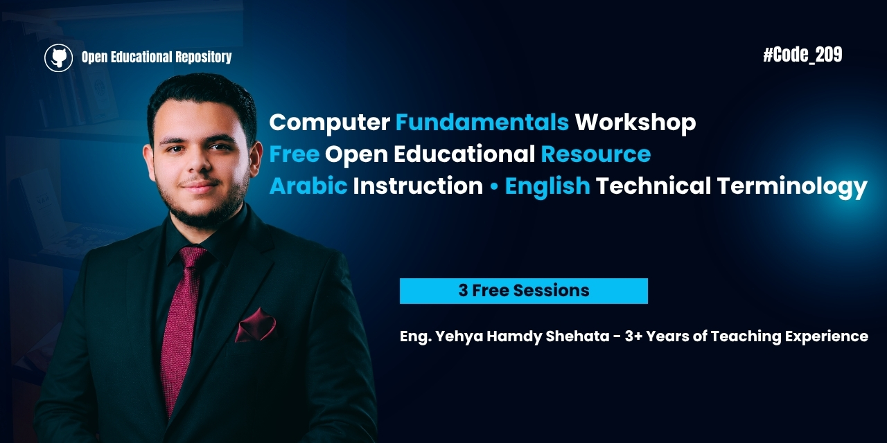

<div align="center">



# 🚀 Computer Fundamentals Workshop

### Build a Strong Foundation Before Learning Programming

📚 Arabic Content • 💻 English Technical Terminology • 🎥 Completely Free

</div>

---

# 📖 About

**Computer Fundamentals Workshop** is a free introductory workshop designed to help beginners build a strong foundation in **Computer Science** before learning programming.

The workshop was originally delivered as a free three-session series for first and second-year high school students. However, the content is suitable for **anyone starting their journey in Computer Science**.

Throughout the workshop, concepts are explained in **Arabic**, while introducing the **English technical terminology** used in the industry, making it easier for learners to continue studying from documentation, courses, and technical references.

---

# 🎯 Learning Objectives

By the end of this workshop, you will be able to:

- Understand how computers work.
- Differentiate between Hardware and Software.
- Understand the role of Operating Systems.
- Learn how the Internet works.
- Understand Networking fundamentals.
- Build a strong foundation before learning programming.
- Become familiar with essential Computer Science terminology.

---

# 📚 Workshop Sessions

## 💻 Session 01 — Computer Fundamentals

### Topics Covered

- Hardware vs Software
- Computer Components
- CPU
- RAM
- HDD & SSD
- Motherboard
- Input & Output Devices
- Operating System

📄 **Slides**

- [Computer Fundamentals PDF](./session-01/Computer%20Fundamentals_compressed.pdf)

🎥 **Watch the Session**

- https://youtu.be/ALH-GZzl7tA

---

## 🌐 Session 02 — Internet Fundamentals

### Topics Covered

- Computer Networks
- Router
- Server
- Firewall
- IP Address
- DNS
- How WhatsApp Messages Travel Through the Internet

📄 **Slides**

- [Internet Fundamentals PDF](./session-02/Internet%20Fundamentals_compressed.pdf)

🎥 **Watch the Session**

- https://youtu.be/99YaPWwyAO0

---

## 👨‍💻 Session 03 — Programming Fundamentals

### Topics Covered

- Programming History
- Transistors
- Machine Language
- Assembly Language
- Compiler
- High-Level Programming Languages
- Programming Fields

📄 **Slides**

- [Programming Fundamentals PDF](./session-03/Programming%20Fundamentals_compressed.pdf)

🎥 **Watch the Session**

- https://youtu.be/xr6d2603hzA

---

# 📺 Watch the Complete Workshop

### 🎬 YouTube Playlist

https://youtube.com/playlist?list=PLFMmgnRWCslo&si=pjQTd6ib4qNvsIgB

### 📺 YouTube Channel

https://www.youtube.com/@Code_201

---

# 💬 Student Feedback

This repository includes feedback received from students who attended the workshop.

You can find the feedback inside the **feedback/** directory.

---

# 📂 Repository Structure

```text
.
├── assets
│   ├── README.md
│   └── banner.png
│
├── session-01
│   ├── README.md
│   └── Computer Fundamentals_compressed.pdf
│
├── session-02
│   ├── README.md
│   └── Internet Fundamentals_compressed.pdf
│
├── session-03
│   ├── README.md
│   └── Programming Fundamentals_compressed.pdf
│
├── feedback
│   ├── README.md
│   ├── feedback-01.png
│   ├── feedback-02.png
│   ├── feedback-03.png
│   ├── feedback-04.png
│   ├── feedback-05.png
│   ├── feedback-06.png
│   ├── feedback-07.png
│   ├── feedback-08.png
│   ├── feedback-09.png
│   └── feedback-10.png
│
├── LICENSE
└── README.md
```

---

# 🎓 Who Is This Workshop For?

This workshop is suitable for:

- Beginners
- High School Students
- University Freshmen
- Self-Learners
- Anyone Interested in Computer Science
- Anyone Planning to Learn Programming

---

# 📦 What's Included?

This repository contains:

- 📄 PDF Slides
- 🎥 YouTube Sessions
- 📚 Session Documentation
- 💬 Student Feedback
- 📖 Beginner-Friendly Explanations

---

# 🛣️ Recommended Learning Path

```text
Computer Fundamentals
        ↓
Internet Fundamentals
        ↓
Programming Fundamentals
        ↓
Choose Your First Programming Language
        ↓
Data Structures
        ↓
Algorithms
        ↓
Git & GitHub
        ↓
Choose Your Career Path
```

---

# ⭐ Support the Project

If you found this workshop helpful, you can support it by:

- ⭐ Starring this repository
- 📺 Watching the YouTube playlist
- 👍 Subscribing to the YouTube channel
- 🔄 Sharing the workshop with others
- 💬 Providing feedback or suggestions

---

# 🤝 Contributing

Found a typo, mistake, or have an idea to improve the workshop?

Feel free to open an **Issue** or submit a **Pull Request**.

---

# 👨‍🏫 Instructor

**Yehya Hamdy Shehata**

- Computer Science Student
- Technical Instructor
- Founder of **Code_201**

### Connect with Me

- GitHub: https://github.com/YHS003
- LinkedIn: https://www.linkedin.com/in/yehya-shehata/
- YouTube: https://www.youtube.com/@Code_201
- TikTok: https://www.tiktok.com/@yehyahamdyshehata
- Instagram: https://www.instagram.com/yehyahamdyshehata
- Facebook: https://web.facebook.com/profile.php?id=61562286009636

---

# 📄 License

This work is licensed under the **Creative Commons Attribution-NonCommercial 4.0 International (CC BY-NC 4.0)** License.

You are free to:

- Share the materials.
- Use them for learning and educational purposes.

You may **not** use the materials for commercial purposes without permission.

---

<div align="center">

## ⭐ If you found this repository useful, don't forget to give it a Star!

**Happy Learning ❤️**

</div>
